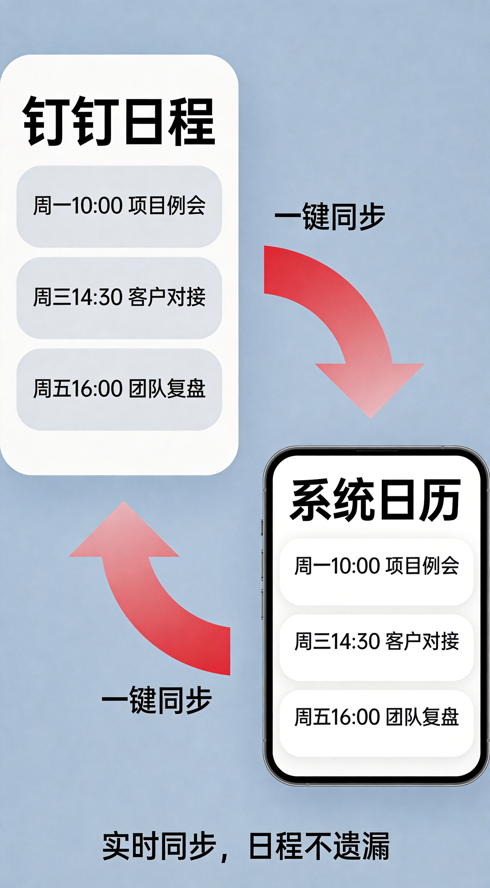

# 校园信息化周报（第 1 期·创刊号）

> 🏫 宁波诺丁汉大学附属中学 · 信息办出品
> 📅 2026年5月9日 · 每周五发布

---

各位老师好！

欢迎阅读《校园信息化周报》创刊号！这是信息办全新推出的栏目，每周五与大家见面。我们会分享真正好用的工具、学校里的隐藏技巧、以及和你相关的行业动态。

**程凡老师**说：信息化不是高高在上的概念，而是实实在在帮你省时间的神器。让我们一起让工作更轻松！

---

## 🔧 本周好物

> 不说废话，只推真正好用的

---

### ✦ 扣子（Coze）——零代码搭建你的专属AI助手

**一句话说清：** 不用写代码，像搭积木一样创建一个能聊天的AI小助手，它能帮你写教案、出通知、批改评语。

**学校怎么用：**

- 📝 **自动生成教案**：输入"高一数学第一节课：集合的概念"，AI帮你生成包含教学目标、重难点、导入设计的教案初稿
- 📢 **批量处理通知**：把班级信息丢给AI，一键生成家长会通知、安全提醒、考试须知
- ✍️ **作文评语帮手**：粘贴学生作文，AI给出评语方向建议（注意：最终评语还是要老师把关哦）
- 📊 **成绩分析报告**：把班级成绩表格扔进去，AI帮你总结各分数段分布、错题类型

**三步上手：**
1. 打开网址 [coze.cn](https://coze.cn)，用手机号注册登录
2. 点击「创建Bot」，给AI助手起个名字（比如"程老师助手"）
3. 在「人设与提示词」里描述它是什么角色，然后添加它需要会的技能（比如"帮我写通知"）

🔗 **地址：** [coze.cn](https://coze.cn)（国内版，更稳定）

---

### ✦ Gamma——输入大纲，PPT秒生成

**一句话说清：** 跟AI说出你想讲什么，它直接给你生成一套精美的PPT，不用再花时间找模板、调格式。

**学校怎么用：**

- 📚 **公开课课件**：输入"细胞的结构与功能-高中生物高一"，AI生成包含图文、图表、动画的完整课件
- 🎓 **家长会PPT**：告诉AI"高一年级家长会，内容包括：升学政策解读、学生表现分析、下阶段安排"，一键生成汇报材料
- 📋 **培训演示**：教研活动、师训会议，输入主题，生成专业培训材料

**三步上手：**
1. 打开 [gamma.app](https://gamma.app)，用邮箱或Google账号注册
2. 点击「New with AI」，选择「Gamma（New）」模式
3. 在输入框里描述你的PPT主题，越具体越好（比如"高中英语阅读理解技巧，包含4个方法和3个例题"）

💡 **小贴士：** 生成后可以在线编辑，修改文字、调整配色、更换图片，非常方便！

🔗 **地址：** [gamma.app](https://gamma.app)

---

## 🏫 校内攻略

> 你身边的功能，你可能还不知道

---

### 钉钉日程同步到手机日历——再也不会错过任何一个会议

每次开会都要反复确认时间？钉钉日程和手机日历不同步，容易错过重要通知？

其实钉钉早就支持「同步到系统日历」了，设置一次，以后钉钉里的会议、提醒都会自动出现在你的手机日历里！

**三步搞定：**

1. **打开钉钉 → 工作台 → 日历**
   - 点击右上角「+」新建日程，或打开已有的日程
   - 注意看底部或右上角有没有「同步到日历」的按钮

2. **开启日历权限**
   - 如果是第一次用，钉钉会请求访问日历权限，点击「允许」
   - iOS用户：设置 → 钉钉 → 日历 → 允许
   - 安卓用户：设置 → 应用 → 钉钉 → 权限 → 日历 → 允许

3. **验证同步成功**
   - 打开手机自带的「日历」App
   - 看看钉钉里的日程是不是已经出现了

💡 **小贴士：** 如果找不到同步按钮，可能是钉钉版本较老，去应用市场更新一下哦！

💡 **进阶技巧：** 在钉钉日历里设置「重复日程」——每周例会只要设一次，自动每周提醒你！

---

## 🌏 值得关注

> 教育/政策/AI，只挑和你有关的

---

### 📌 头条：教育部等五部门联合发文，AI教育正式进入中小学！

**发生了什么：** 2026年4月2日，教育部、国家发展改革委、工业和信息化部、科技部、国家数据局五部门联合印发了《"人工智能+教育"行动计划》。这是国家层面首个系统部署AI与教育融合的政策文件。

**一句话说明：** 国家要求AI教育要进入中小学课堂、考试评价，老师们的AI素养培训也要提上日程了。

**对我们意味着什么：**
- 📢 **升学考试可能要考AI了**：教育部明确提出AI要"进课程、进教学、进考试评价"，未来学生需要掌握基本的AI知识
- 📚 **我们学校要开始规划AI课程了**：政策要求开齐开足AI相关课程，我们也要考虑如何落地
- 🎯 **老师AI培训会越来越多**：国家要制定教师AI素养标准，开展分层分类培训，我们信息办会第一时间分享学习资源

🔗 **政策原文：** [教育部官网](http://www.moe.gov.cn/srcsite/A16/s3342/202604/t20260410_1433240.html)

---

### 📌 各地都在行动：AI教育已经从"要不要做"变成"怎么做"

**发生了什么：** 江苏、四川、重庆、贵州等省份密集出台AI教育实施方案。四川要求AI通识教育从选修课升级为必修课；重庆提出2027年新一代教育智能终端普及率要达到80%以上；武汉面向全市征集智能备课、教育大模型等创新应用。

**一句话说明：** 全国都在推进AI教育，各地都在找好的应用方案，这是大趋势。

**对我们意味着什么：**
- 🚀 **AI工具会越来越多**：智能备课系统、AI批改、学情分析等工具会越来越成熟好用
- 📈 **参考学习的机会增加**：看到别人怎么用，我们能少走弯路
- 💪 **先行者有优势**：现在就开始尝试AI工具的老师，未来会更轻松

---

### 📌 AI批改作业：不是取代老师，而是帮老师"减负"

**发生了什么：** 多地学校开始试点AI辅助批改客观题和部分主观题，AI自动统计错题、生成学情报告，老师从繁琐的批改中解放出来，腾出时间做更有价值的教学设计。

**一句话说明：** AI帮你把"机械劳动"做完，你来做最核心的"育人"工作。

**对我们意味着什么：**
- ⏰ **批改时间大幅减少**：选择题、填空题AI秒级批改，节省的时间可以更多关注学生
- 📊 **学情分析更精准**：AI自动统计错题分布，帮你快速了解班级薄弱点
- ✨ **把精力放在刀刃上**：批改交给AI，备课、个性化辅导、激发学生兴趣这些事，更需要老师来做

---

## 💡 一周一词

**本期词：API（应用编程接口）**

> 用大白话解释，看完就能跟人聊

---

### 打个比方：API就像餐厅的点餐系统

想象你去一家餐厅：

- **你**（用户）想吃饭
- **服务员**（API）接收你的需求："我要一份宫保鸡丁"
- **厨房**（后台系统）根据需求做好菜
- **服务员**（API）把菜端回来给你

**API就是那个"中间人"——它不做饭，但它负责把你的请求传达给系统，再把结果返回给你。**

---

### 学校里的例子

**场景1：钉钉打开学校课表**
- 你的手机钉钉显示"今天第3节是数学课"
- 这个信息不是钉钉自己查的，而是钉钉通过API向学校的"选课系统"问了数据
- 学校系统返回："张三，班级高一2班，今天第3节数学，教室201"
- 钉钉再把这个信息展示给你

**场景2：氚云统计学生信息**
- 你在氚云做了一个"学生信息收集"表单
- 家长填完后，数据自动汇总到电子表格里
- 这个过程就是氚云通过API把数据"搬运"到了该去的地方

---

### 知道这个有什么用？

1. **理解"为什么这两个系统能对接"**：当信息办说"要把钉钉和氚云打通"，就是在配置它们之间的API
2. **提需求时更清楚**：跟技术人说"我想让A系统的数据自动到B系统"，他们就知道要配置API了
3. **理解Coze等工具的原理**：Coze能帮你写教案，其实就是Coze的AI通过API调用了文档资料库

---

💬 **欢迎找程凡老师聊聊：** 如果你对API感兴趣，想了解更多怎么用API提升工作效率，信息办随时欢迎交流！

---

## 📝 下期预告

- 🛠️ 更多实用工具推荐
- 📱 钉钉隐藏功能第二弹
- 🎓 如何用AI辅助命题

---

*📝 投稿·建议·问题 → 信息办 程凡老师*
*📧 也欢迎通过钉钉私信我们*

---

> **往期回顾：** 创刊号首发！
> **订阅方式：** 每周五在钉钉群发布，关注不迷路～

