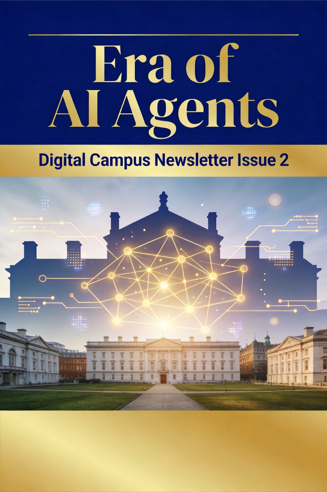
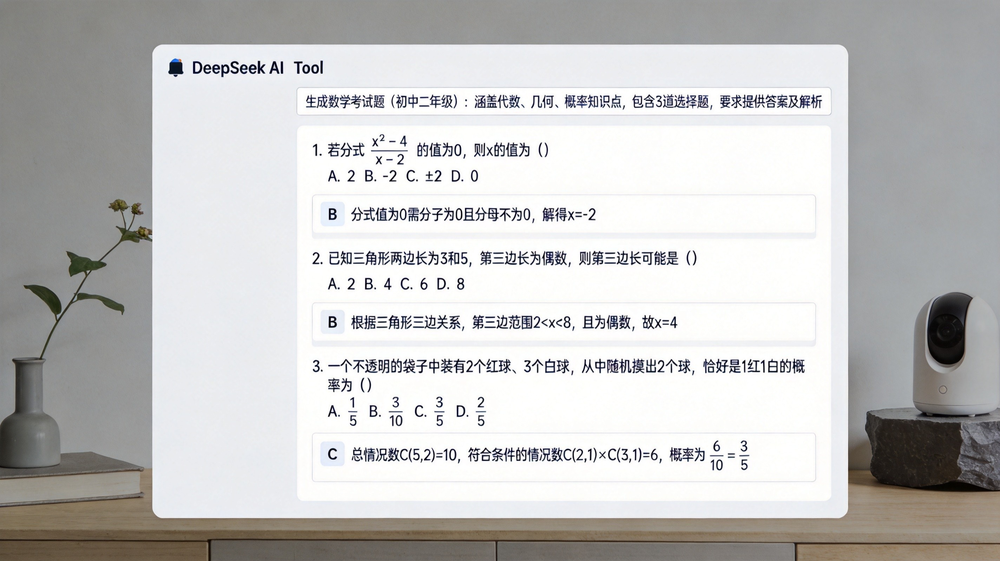
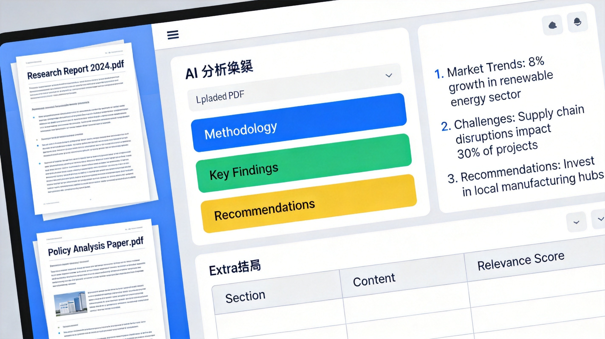
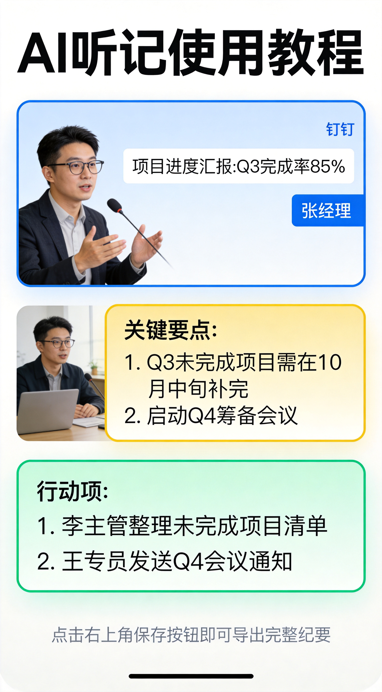

# 校园信息化周报（第 2 期·智能体时代）

> 🏫 宁波诺丁汉大学附属中学 · 信息办出品
> 📅 2026年5月16日 · 每周五发布

---

各位老师好！

欢迎阅读第2期《校园信息化周报》！

**程凡老师**说：本周周报的主题是"智能体时代"。什么是智能体？简单说，就是AI从"回答问题"进化到"帮你做事"。本期我们精选了两个超实用的AI工具+一个钉钉隐藏功能，让你感受AI如何真正成为你的工作助手。

---

## 🔧 本周好物

> 不说废话，只推真正好用的

---

### ✦ DeepSeek——免费好用的国产AI大模型

**一句话说清：** 国产AI大模型，完全免费，写教案、出题目、做分析样样在行。

**学校怎么用：**

- 📝 **出题神器**：告诉它"出10道高一数学集合概念的选择题，含答案解析"，秒出
- 📊 **教案助手**：输入课题和学情，生成包含教学目标、重难点、板书设计的教案初稿
- 🔍 **文献阅读**：丢一篇教研论文进去，帮你提炼核心观点和研究方法
- 💬 **日常问答**：翻译、写作、数据分析，随时问随时答

**三步上手：**
1. 打开 [chat.deepseek.com](https://chat.deepseek.com)，用手机号注册
2. 选择「DeepSeek-V4」模型（推荐，能力最强）
3. 直接对话，说出你的需求

💡 **小贴士：** DeepSeek V4支持100万字长文本，把整本教材丢进去都能读懂！

🔗 **地址：** [chat.deepseek.com](https://chat.deepseek.com)

---

### ✦ Kimi——超长文档处理王者

**一句话说清：** 专治"文档太长读不完"，丢几十页PDF进去直接出总结。

**学校怎么用：**

- 📚 **读论文**：教研论文、课题报告，上传后Kimi帮你提炼核心观点、研究方法、结论
- 📋 **方案整理**：学校各类方案文件太长，丢给Kimi快速生成摘要和待办
- 📖 **教材解读**：上传一个章节的教材PDF，Kimi帮你梳理知识点和教学重难点
- 📝 **会议纪要**：长篇会议录音转写文字后，Kimi帮你提炼关键决议和待办事项

**三步上手：**
1. 打开 [kimi.moonshot.cn](https://kimi.moonshot.cn)，用手机号登录
2. 点击「上传文件」，把PDF/Word/PPT丢进去（最多50个文件同时处理）
3. 输入你的需求，比如"帮我总结这份报告的核心内容"

💡 **小贴士：** Kimi K2.5还能直接输出Word、Excel、PPT文件，从分析到成品一条龙！

🔗 **地址：** [kimi.moonshot.cn](https://kimi.moonshot.cn)

---

## 🏫 校内攻略

> 你身边的功能，你可能还不知道

---

### 钉钉AI听记——开会听课不用再手忙脚乱记笔记

每次教研会、听课评课，一边听一边记，结果笔记乱、重点漏、会后还得花一两个小时整理？

钉钉自带的「AI听记」就能搞定！录音→转文字→自动生成结构化纪要，全程解放双手。

**三步搞定：**

1. **打开钉钉 → 首页右下角「+」或长按钉钉图标 → 找到「AI听记」**
   - 如果在开会，也可以在钉钉会议中开启「云录制」，自动启用AI听记

2. **选择模板 → 推荐选「教学笔记」或「听课评课」模板，点击开始录音**
   - AI会实时转写文字，自动区分不同发言人

3. **录音结束 → AI自动生成：全文转写 + 课堂摘要 + 重点清单 + 待办事项**
   - 可导出PDF/Word，分享到教研组群

💡 **小贴士：**
- 嘈杂环境下也没问题，AI能过滤500+种环境噪音
- 自动提取的待办可以一键同步到钉钉待办，任务不遗漏
- 如果学校有DingTalk A1录音卡，效果更佳——40g小卡片，吸附在手机背面就能用

---

## 🌏 值得关注

> 教育/政策/AI，只挑和你有关的

---

### 📌 重磅：2026世界数字教育大会本周日在杭州开幕！

**发生了什么：** 5月11日-13日，2026世界数字教育大会在杭州举行，主题"人工智能+教育：变革 发展 治理"。这是全球教育领域的顶级盛会。

**一句话说明：** 全球教育AI大事件就在家门口，中国将发布8项重磅成果。

**对我们意味着什么：**
- 🌐 **大会将发布《人工智能教育伦理：参考框架》，AI怎么用终于有标准了**
- 📊 **《全球数字教育发展指数(2026年)》出炉，82个国家参与评价，中国方案成为全球参考**
- 🎓 **AI教育从"要不要做"进入"怎么做、做得好不好"的新阶段**

---

### 📌 DeepSeek V4双版本上线，教育场景迎来"核弹级"升级

**发生了什么：** 2026年4月24日，DeepSeek发布V4版本，双版本（Pro旗舰版 + Flash高效版）全部支持100万字长文本，而且免费。

**一句话说明：** 国产AI最强模型再升级，老师用它能处理整本教材、出整套试卷。

**对我们意味着什么：**
- 🆓 **完全免费就能用，学校不用额外采购AI工具**
- 📖 **100万字上下文 = 一次性吃透一整本教材或几十篇论文**
- 🤖 **Agent能力大升级，未来可以帮你自动完成复杂任务**

---

### 📌 全国多省推进AI教育落地：从政策到课堂

**发生了什么：** 四川将AI通识课从选修升级为必修；武汉面向全市征集AI+教育解决方案；广西启动中小学AI教育试点；江苏培养AI领航教师。

**一句话说明：** AI教育不再停留在文件里，各地都在真刀真枪地干。

**对我们意味着什么：**
- 📚 **AI课程可能很快成为必修，我们要提前准备**
- 🎯 **多地探索"AI+学科"融合教学，我们可以借鉴**
- 💪 **谁先学会用AI，谁就先受益——现在开始不晚**

---

## 💡 一周一词

**本期词：Agent（智能体）**

> 用大白话解释，看完就能跟人聊

---

### 打个比方：Agent就像一个能独立干活的实习生

想象你招了一个实习生：

- 你说"帮我整理一下上周的教研记录"，他会自己去找到文件、读懂内容、提炼重点、排版输出
- 不需要你每一步都指挥，他自己能理解任务、规划步骤、调用工具、完成交付
- **Agent就是AI里的"实习生"——不只是回答问题，而是能主动帮你做事**

---

### 学校里的例子

**场景1：通知助手**
- 你在Coze上建了一个"通知助手"Agent
- 告诉它"每周五下午把下周的校内活动整理成通知发到群里"
- 之后每周五它自己就干了

**场景2：请假审批**
- 你在钉钉里设置一个"请假审批"Agent
- 家长提交请假申请后，Agent自动检查请假类型、扣课判断、通知班主任
- 不用人工逐条审批

---

### 知道这个有什么用？

1. **理解Coze/扣子平台的核心**：你创建的Bot本质上就是一个Agent
2. **区分"聊天AI"和"智能体"**：聊天AI只回答问题，Agent能主动执行任务
3. **理解学校信息化方向**：从"人找系统"到"Agent帮你找、帮你做"

---

💬 **欢迎找程凡老师聊聊：** 如果你对Agent感兴趣，想动手创建一个属于自己的AI助手，信息办随时欢迎交流！

---

*📝 投稿·建议·问题 → 信息办 程凡老师*
