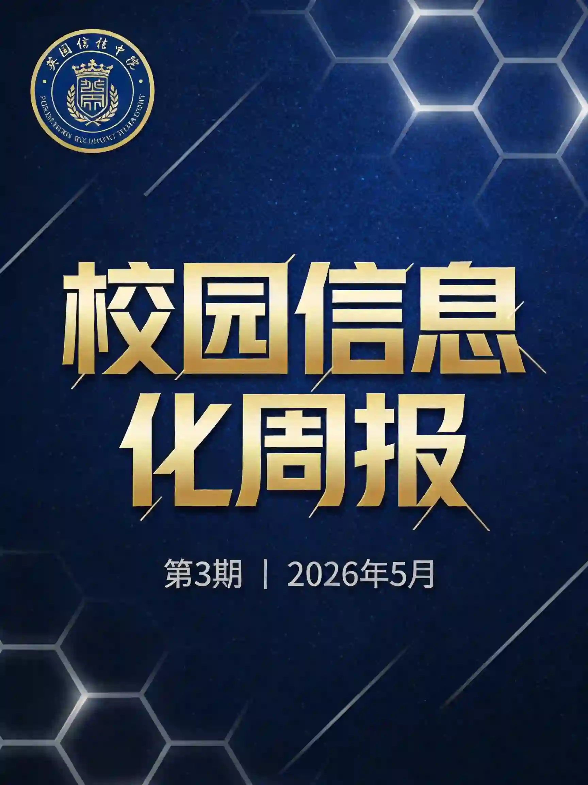
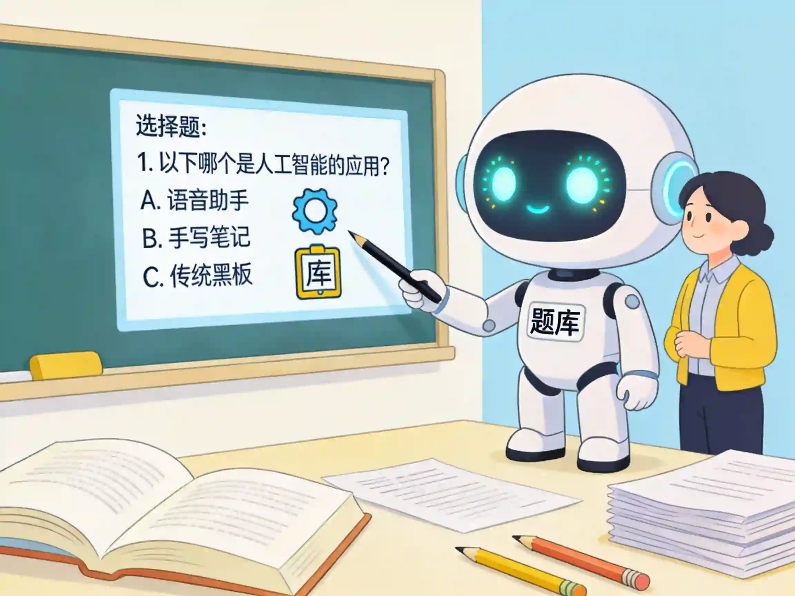

# 校园信息化周报（第3期）

> 🏫 宁波诺丁汉大学附属中学 · 信息办出品
> 📅 2026年5月16日 · 每周五发布
> 👤 程凡老师

---

## 🔧 本周好物

> 不说废话，只推真正好用的 ✨

---

### ✦ 考试宝

**一句话说清：** 上传文档，AI自动识别题目格式，一键生成题库

**学校怎么用：** 期中期末出卷时，把教材PDF或Word丢进去，10分钟生成基础题库初稿，老师再微调审核，省时又省力！

**三步上手：**
1. 打开考试宝官网
2. 点击「AI导题」→ 上传文档
3. 预览勾选题目 → 确认生成题库

💡 **核心理念：** AI生成初稿，教师审核定稿

🔗 地址：https://www.kaoshiyun.com.cn/

---

### ✦ 匡优AI出题

**一句话说清：** 直接输入"生成10道关于xxx的单选题"，AI立刻出题

**学校怎么用：** 备课时的随堂测验超方便！输入知识点+题型+数量，立刻出卷，再也不用为出题绞尽脑汁~

**三步上手：**
1. 访问匡优AI官网
2. 输入自然语言指令，如："生成5道关于光的折射的选择题"
3. 导出Word文档

💡 **核心理念：** AI生成初稿，教师审核定稿

🔗 地址：https://ai.kyou.ltd/pc

---

## 🏫 校内攻略

> 你身边的功能，你可能还不知道 📱

---

### 钉钉运动步数同步指南

**核心问题：** 为什么你的钉钉步数老是0或者不准？

别慌，这是因为手机没有开启对应的同步权限！按手机品牌来设置：

---

#### 📱 华为手机

1. 打开钉钉 → 搜索「钉钉运动」
2. 点击「绑定设备」
3. 选择「华为运动健康」→ 完成授权

---

#### 📱 小米手机

1. 打开「设置」→ 「账号与同步」
2. 点击「小米健康」
3. 选择「第三方接入」→ 勾选「钉钉」

---

#### 📱 苹果手机（iPhone）

1. 打开钉钉 → 点击「我的」
2. 进入「运动」→ 点击「运动健康授权」
3. 勾选「步数」选项

---

#### 📱 其他手机

钉钉运动 → 「我的」→ 「运动数据」→ 绑定对应硬件/App（如小米手环、Keep等）

---

### ❓ 常见问题排查

| 问题 | 解决方法 |
|------|----------|
| 步数一直是0？ | 检查是否打开过钉钉（钉钉只记录**当天打开后**的步数） |
| 权限被收回了？ | 设置 → 应用 → 钉钉 → 允许后台运行 + 身体活动权限 |
| 省电模式干扰？ | 把钉钉加入电池白名单 |
| 和咕咚/Keep不同步？ | 需要**双向授权**——App里和钉钉里都要设置 |

💡 **小贴士：** 建议每天先打开钉钉走几步，这样当天的步数就能被记录啦~

---

## 💡 一周一词

**本期词：Token（令牌）**

> 用大白话解释，看完就能跟人聊 😎

**打个比方：** 就像去银行办业务，要先刷身份证领一个排队号。Token就是程序世界的"排队号/门禁卡"——"刷卡"才能让程序帮你办事。

**一句话解释：** 它是一串加密字符，用来证明"你是你"、"你有权限做这件事"

**学校里的例子：** 学校想用钉钉API自动导出考勤表，需要用Token证明"我是合法用户"，就像进门要刷卡一样。

**知道这个有什么用：** 理解Token能帮你理解为什么有些工具要申请API Key、为什么有时会提示"Token过期"，再看到这些提示就不慌啦~

---

## 🌍 值得关注

> 教育/政策/AI，只挑和你有关的 🚀

---

### AI眼镜开始进校园了？

**南京"黑科技"组团进校园** —— 2026年4月，金陵科技学院举办了"AI筑梦 智启校园"活动，AI眼镜、具身智能机器人等前沿产品集体亮相。

**这些AI眼镜能做什么？**
- 🎓 **课堂辅助**：AR实景导航、实时答疑、双语翻译
- 🔬 **虚拟实验**：物理、化学实验的AR模拟，安全又直观
- 🎧 **录音学习**：上课自动录音转写，生成课堂笔记
- 🌍 **语言学习**：实时翻译外文文献

**全国已有300余所中小学试点智能眼镜辅助教学**，职业教育实训基地采用率超25%。

**对我们意味着什么？**

虽然目前AI眼镜更多出现在高校和职业教育，但"AI+教育"的趋势已经不可阻挡。作为中学老师，我们可以先从**音频眼镜**这类"无摄像头"设备体验起——它可以帮你上课自动录音转写，生成会议纪要，说不定能成为备课神器哦！

---

*📝 投稿·建议·问题 → 信息办 程凡老师*
