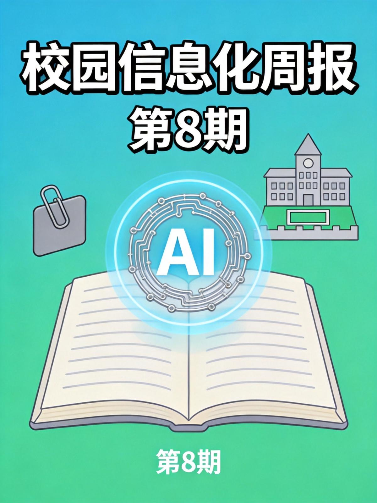
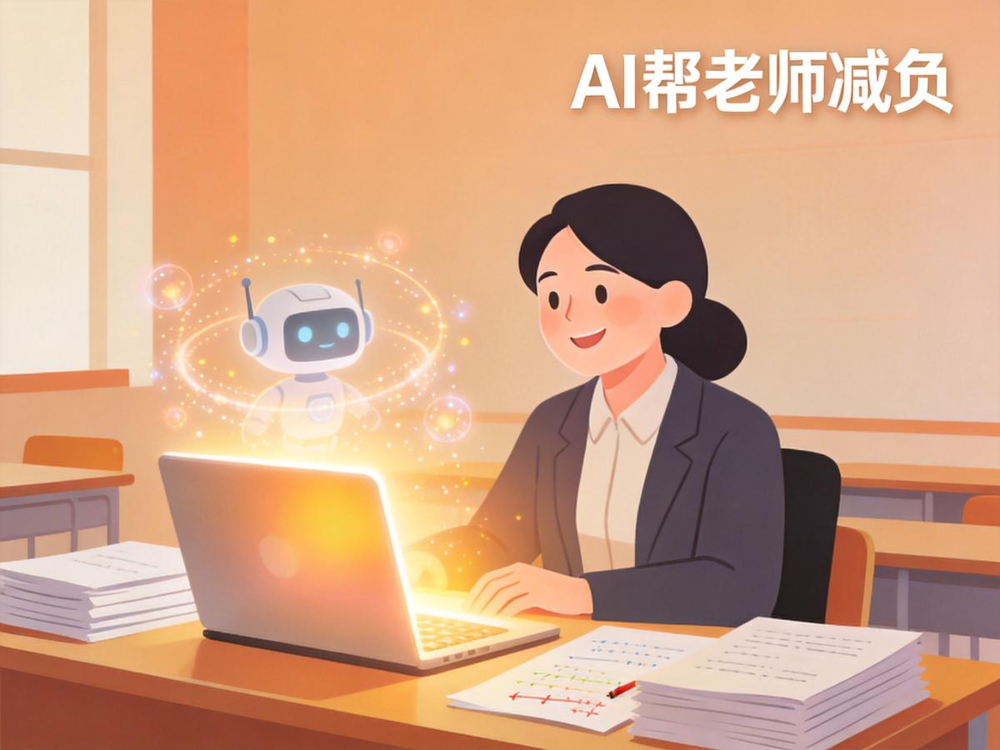
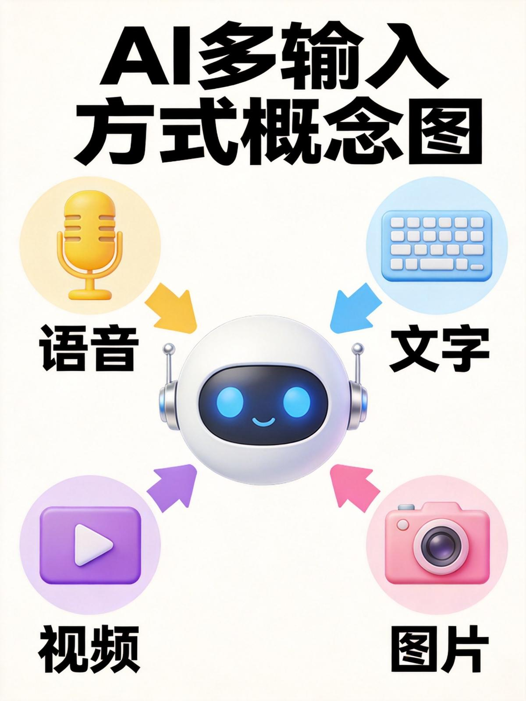

# 校园信息化周报（第 8 期）

> 🏫 宁波诺丁汉大学附属中学 · 信息办出品
> 📅 2026年6月20日 · 每周五发布

---

## 🔧 本周好物

> 不说废话，只推真正好用的

### ✦ MagicSchool AI：帮老师每周省10小时的"AI助教"

**一句话说清：** 一个专门为教师设计的AI平台，备课、出题、写教案、批改、家校沟通，一句话搞定

**这是怎么回事：** MagicSchool AI 是目前全球增长最快的教育科技产品之一，已进入美国超过13000所学校和学区，被全球160个国家的600万教育工作者使用。据[36氪](https://36kr.com/p/3857324103013384)报道，在2026年最具创新力教育科技企业评选中，MagicSchool AI榜上有名，B轮融资4500万美元。官方数据显示，它能帮助教师每周节省最多10小时的工作时间。

它最厉害的地方在于"懂教育"——不是通用AI套个壳，而是专门针对教学场景训练。你告诉它学科、年级、教学目标，它就能生成符合课程标准的内容。

**能帮你做什么：**
- 📝 **备课助手**：输入课题，自动生成教案、PPT大纲、课堂活动设计
- ✍️ **出题工具**：按知识点、难度、题型批量生成练习题和测试卷，附带答案解析
- 📊 **个性化学习**：根据学生水平生成分层作业，同一知识点出不同难度的版本
- 💬 **家校沟通**：一键生成家长通知、学生评语、成绩反馈模板
- 🔍 **内容审核**：自动检查AI生成内容的准确性和适用性

**三步上手：**
1. 打开 [magicschool.ai](https://www.magicschool.ai)，用邮箱注册免费账号
2. 选择你的角色（教师）和学科，系统自动匹配工具
3. 用自然语言描述需求，比如"帮我出一套高一物理牛顿第二定律的练习题，10道选择题，难度中等"

💡 **小贴士：** 免费版已包含80+教学工具，基本满足日常需求。界面支持中文输入，但部分高级功能目前以英文为主，可以用浏览器翻译插件辅助

> 💡 **核心理念：** AI不是来替代老师的，而是把老师从重复性劳动中解放出来，让时间花在真正需要人的判断和温度的地方。

---

## 🏫 校内攻略

> 你身边的功能，可能你还不知道

### 钉钉「家校本」升级：家校沟通更方便了

钉钉家校本系统近期进行了一次升级，新增了不少实用功能，据[畅捷通](https://hyc.chanjet.com/hyczg/48914baa2c5bd.html)报道，本次升级涵盖功能增强、性能提升和安全加固三个方面。

**这次升级带来了什么：**

**👨‍👩‍👧 家长端——新增家长群功能**
- 家长可以在群内快速查看学校通知、活动安排
- 与老师即时沟通，不用单独加好友
- 自动接收孩子的作业、成绩等信息推送

**👨‍🎓 学生端——新增作业管理功能**
- 在线查看老师布置的作业，提交电子版作业
- 老师可直接在系统中批改、标注、反馈
- 作业记录自动归档，期末复习时一目了然

**👩‍🏫 老师端——新增评语功能**
- 快速为学生撰写评语，支持模板化批量操作
- 评语自动关联学生档案，家长可直接查看
- 成绩反馈、行为记录、家校沟通一体化

**性能方面：**
- 系统响应速度提升，并发处理能力增强
- 安全防护机制加固，保障学生数据隐私

💡 **小贴士：** 如果学校钉钉还没开通家校本功能，可以在钉钉管理后台 → 应用管理 → 搜索"家校本"申请开通。目前对教育版用户免费

---

## 🌏 值得关注

> 教育/政策/AI，只挑和你有关的

### A. 韩国首尔禁止学生戴AI眼镜参加期末考试

据[36氪](https://36kr.com/newsflashes/3851265277220103)报道，6月12日，韩国首尔市教育厅下发通知，禁止考生戴AI智能眼镜参加期末考试，违者按作弊处理。这是全球首次将AI眼镜列入考场违禁物品清单。

📌 **对我们意义：** 智能眼镜正在快速进入校园——实时翻译、拍照搜题、语音问答，功能越来越强大。技术发展的速度远超考试管理的应对速度。我们的考场规则是否也需要与时俱进？这个问题值得提前思考。

### B. 新加坡千人教育大会：AI不会让老师失业

据[名堂文化空间](http://m.toutiao.com/group/7652707407893742107/)报道，新加坡国立教育学院举办"重构教学法国际会议"，超过1000名教育工作者参会。会议达成共识：老师不会被AI取代，但角色要变——从"知识搬运工"变成"翻译官"和"导航员"。大会还发布了亚太地区首个"AI教育伦理框架"草案，提出AI工具要透明、公平、保护隐私，且人类监督不能少。

📌 **对我们意义：** "最好的学习模式不是学生+AI，而是学生+老师+AI。"这句话值得每个教育工作者深思。AI能传授知识，但发现学生的情绪变化、及时鼓励和引导，只有人能做到。我们的价值不是被AI取代，而是学会与AI协作。

### C. AI短剧占微短剧总量95%，职业院校已开始培养相关人才

据[中国青年报](http://m.toutiao.com/group/7652866706234262056/)报道，中国网络视听协会数据显示，2026年第一季度全行业上线微短剧约12.8万部，其中AI短剧超过12.2万部，占比超95%。广东、浙江等地职业院校已把课堂搬进企业，学生直接参与AI短剧制作。

📌 **对我们意义：** AI不只改变了教学工具，正在重塑整个创意产业。对于学校的多媒体、影视、设计类课程，是否需要重新审视培养目标？传统制作流程正在被AI改写，教学也需要跟上。

---

## 💡 一周一词

**本期词：多模态（Multimodal）**

> 用大白话解释，看完就能跟人聊

**📖 什么是多模态？**

**一句话解释：** 多模态就是AI能同时"看、听、读、说"——不只是文字交流，还能理解图片、听懂语音、分析视频。

**打个比方：** 你去医院看病，医生不只听你口头描述（文字/语音），还会看你的气色（图片），听你的心跳（音频），看检查报告（数据）。综合这些信息，才能做出准确判断。多模态AI就是这样一个"全科医生"，多个渠道的信息一起处理。

以前你只能跟AI打字聊天，现在你可以：
- 📸 拍一道数学题，AI直接识别题目并给出解题步骤
- 🗣️ 上课时语音录入，AI实时生成课堂纪要
- 🎬 给AI一段视频，让它自动总结要点、生成字幕
- 📊 丢一份Excel表格，AI分析数据并生成图表解读

**学校里的例子：**

- 老师拍下手写试卷 → AI自动识别题目 → 转成电子版题库（这就是多模态：图片→文字）
- 上课时开启语音录制 → AI实时转写并提炼重点 → 课后自动生成笔记（语音→文字）
- 学生上传作文图片 → AI识别内容并给出修改建议（图片→理解→文字反馈）

**知道这个有什么用：**
- 🎯 选AI工具时，关注它支持哪些"模态"——支持越多，使用场景越广
- 💡 理解为什么有些AI比"纯文字聊天"强得多——因为它们能同时处理多种输入
- 🔮 多模态是AI从"能聊天的机器人"变成"能干活的助手"的关键一步

> 趣味知识：网易有道最新款词典笔A7S就是典型的多模态产品——能扫描（图像识别）、能语音问答（语音理解）、能拍照翻译（图像+文字），据[环球网](http://m.toutiao.com/group/7652676456757166602/)报道，它还集成了豆包、千问、DeepSeek、子曰四大模型，可按学科切换使用。

---

*📝 投稿·建议·问题 → 信息办 程凡老师*
