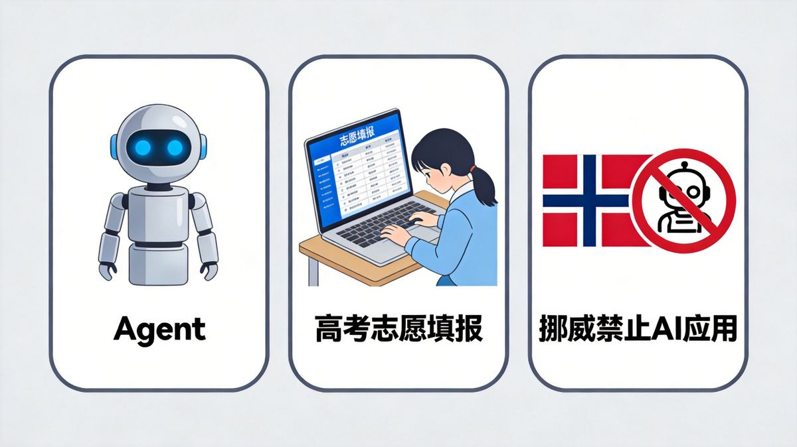
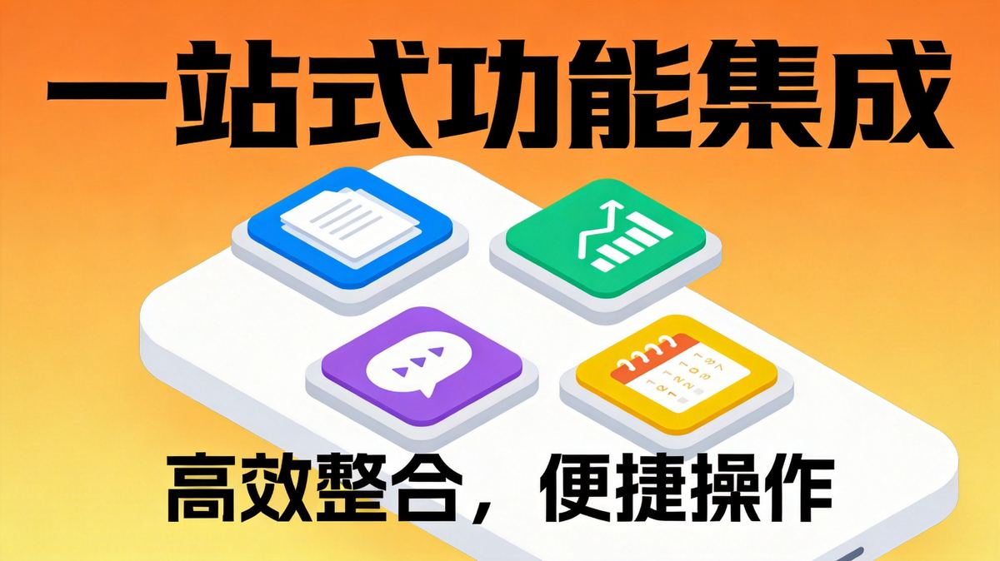

# 校园信息化周报（第 9 期）

> 🏫 宁波诺丁汉大学附属中学 · 信息办出品
> 📅 2026年6月27日 · 每周五发布

---

## 🔧 本周好物

> 不说废话，只推真正好用的

### ✦ 沉浸式翻译：给浏览器装个"双语眼睛"

**一句话说清：** 装上这个插件，外文网页自动显示原文+中文对照，视频字幕、PDF文档也能翻译，基础功能完全免费

**这是怎么回事：** "沉浸式翻译"是一款浏览器插件，2024年入选Chrome年度最佳扩展，目前全球用户超过2000万。它的核心理念是"不替换原文，而是对照显示"——外文在上，中文在下，你可以随时查看原文，阅读体验比整页翻译好得多。据[GitCode博客](https://blog.csdn.net/gitblog_00469/article/details/157241554)介绍，它支持Chrome、Edge、Firefox、Safari等主流浏览器，手机端也能安装。

**能帮你做什么：**
- 🌐 **网页双语对照**：打开任何外文网站，一键切换为"原文+译文"对照模式，排版自动对齐
- 🎬 **视频字幕翻译**：看YouTube、Netflix等外文视频时，自动生成双语字幕
- 📄 **PDF翻译**：直接在浏览器中打开PDF，翻译后保持原排版不乱
- ✍️ **输入框翻译**：在搜索框输入中文，连按三下空格，自动翻译成外文搜索
- 🖱️ **悬停翻译**：鼠标悬停在某个词或段落上，即时显示翻译，不用整页翻译

**三步上手：**
1. 打开 [app.immersivetranslate.com](http://app.immersivetranslate.com)，点击安装，支持Chrome、Edge等主流浏览器
2. 安装后浏览器右上角出现图标，打开外文网站时点击图标即可翻译
3. 记住快捷键：**连按三下空格**，翻译功能立刻弹出，搜索时特别方便

💡 **小贴士：** 基础功能完全免费，支持Google翻译、DeepL等多种翻译引擎。付费版（一年500多元）可调用DeepSeek、千问等AI大模型翻译，翻译质量更高。内置专业术语库，学术论文、医学、法律等领域有专门的术语对照。

> 💡 **核心理念：** 语言不该是获取知识的障碍。装个插件，外文网站随便看，国外视频随便刷，世界一下子就变大了。

---

## 🏫 校内攻略

> 你身边的功能，可能你还不知道

### 钉钉「悟空」：从"会聊天"到"能干活"的AI工作平台

钉钉最近上线了一个新功能——"悟空"。它不是普通的AI聊天助手，而是能直接帮你干活的AI工作平台。据[CSDN](https://blog.csdn.net/YMPzUELX3AIAp7Q/article/details/159255638)报道，2026年3月17日，阿里巴巴正式发布了全球首个企业级AI原生工作平台"悟空"，基于通义大模型，深度接入钉钉文档、日程、审批等应用。

**悟空和普通AI助手有什么不同：**

普通AI助手只能"回答问题"，悟空可以"交付结果"。你说"帮我整理一下这周的会议纪要"，它不只是给你一段文字，而是直接操作钉钉文档创建文件；你说"帮我查一下明天的日程"，它直接打开钉钉日历展示给你。

**核心能力：**
- 🤖 **对话式工作**：用自然语言发起任务，悟空理解目标后自动调用钉钉工具完成
- 📋 **钉钉生态接入**：直接操作文档、日程、审批、待办等钉钉应用，不用切换工具
- 🛠️ **技能中心**：提供文档处理、数据分析、演示文稿等预置技能，还能上传自定义技能
- 🧠 **长期记忆**：记住你的偏好和工作习惯，用得越久越懂你

**三步上手：**
1. 更新钉钉到最新AI 2.0版本，悟空已内置其中
2. 在钉钉对话界面找到悟空入口，直接用自然语言描述你想做的事
3. 试试这几个指令：**"帮我总结今天的会议内容"**、**"创建一个下周的工作日程"**、**"帮我把这个文档转成PPT"**

💡 **小贴士：** 悟空也有独立的桌面客户端（支持macOS和Windows），目前处于邀测阶段。钉钉用户可直接在钉钉内使用，无需额外注册。它能自动继承你在钉钉中的企业权限，所有操作都在安全沙箱中运行。

> 💡 **核心理念：** 以前的AI是"你问它答"，悟空是"你说它做"。从"会聊天"进化到"能干活"，AI终于开始真正进入工作流程了。

---

## 🌏 值得关注

> 教育/政策/AI，只挑和你有关的

### A. 2026，AI从"会聊天"到"会干活"

据[36氪](https://36kr.com/newsflashes/3851265277220103)报道，2026年Google I/O和微软Build两大开发者大会均将AI Agent（智能体）作为核心战略。Google Antigravity平台已服务850万开发者，微软Agent 365切入企业级场景。AI正在从"你问它答"的工具，进化为"你说它做"的代理——不只是生成文本，而是代替人完成完整的工作流程。

📌 **对我们意义：** 本期推荐的钉钉悟空就是典型代表。AI Agent时代，教育场景也会从"用AI查资料"进化到"用AI完成教学任务"——自动批改作业、生成个性化练习、追踪学习进度，这些都将从概念变成日常。

### B. 1400万人用AI填志愿，咨询人数超高考总人数

据[证券时报](http://m.toutiao.com/group/7654845141525561907/)和[凤凰WEEKLY财经](http://m.toutiao.com/group/7654951914895753766/)报道，截至6月24日，累计已有超过1400万用户使用千问AI高考志愿Agent进行院校查询和专业咨询，超过了2026年1290万高考考生的总人数。友松实验室的测评显示，千问在44道客观题中全部答对（准确率100%），人类咨询师平均正确率89.3%。考生最关心的问题是"什么专业未来好就业"。

📌 **对我们意义：** AI填志愿从尝鲜变成了刚需。作为教育工作者，我们需要思考：AI给出的方案越来越专业，学生和家长越来越依赖AI，我们的角色是什么？不是和AI比数据，而是在AI给不出答案的地方——兴趣引导、心理支持、生涯规划——发挥人的价值。

### C. 挪威禁止小学生使用生成式AI

据[央视新闻](http://m.toutiao.com/group/7653405870260224552/)和[新华社](https://m.gmw.cn/2026-06/21/content_1304503876.htm)报道，6月19日挪威首相斯特勒宣布，6至13岁小学生原则上全面禁止使用生成式AI工具，14至16岁初中生需在教师监督下谨慎使用，17至19岁高中生应学习恰当使用AI。新规将于8月底新学年实施。挪威政府还将拨款增加纸质教材供给，扭转过度依赖平板电脑的趋势。

📌 **对我们意义：** 挪威的分级管控思路值得参考：小学阶段禁用、初中阶段限用、高中阶段学用。核心逻辑是——在基础学习能力尚未建立时，不能让AI代劳。这和我们"先学会走再学会跑"的教育理念一致。我们学校在推进AI应用时，也需要按学段差异化对待。

---

## 💡 一周一词

**本期词：Skill（技能）**

> 用大白话解释，看完就能跟人聊

**📖 什么是Skill？**

**一句话解释：** Skill就是给AI装的"App"——AI本身是个通用大脑，装上不同技能就能干不同的活儿。

**打个比方：** 你买了一部新手机，刚开机什么App都没装，只能打电话和发短信。装了微信就能聊天，装了导航就能指路，装了计算器就能算账。AI也一样——裸的AI只能聊天，装上"文档处理"技能就能帮你写文件，装上"数据分析"技能就能帮你做图表，装上"翻译"技能就能帮你翻外文。

**和前面几个概念的关系：**
- **Agent（智能体）**是AI的"人"——它能理解你的需求、自己规划步骤、自动执行任务
- **Skill（技能）**是Agent的"手"——Agent想干活，得有具体的技能可用
- 一个Agent可以装很多Skill，就像一个人可以掌握很多技能

**学校里的例子：**
- 钉钉悟空有"技能中心"——文档处理、数据分析、PPT生成，每个都是一个Skill
- OpenClaw（小龙虾）也支持自己加Skill——装一个天气查询的Skill，它就能帮你查天气
- 千问高考志愿Agent——"查大学""查专业""生成志愿报告"，本质上也是不同的Skill

**知道这个有什么用：**
- 🎯 选AI工具时，看它有多少Skill——技能越多，能干的事越多
- 💡 理解为什么有些AI"只会聊天"——因为它没有装干活用的Skill
- 🔮 未来的趋势是"AI+技能市场"——像手机App Store一样，AI也会有技能商店，按需安装

> 趣味知识：本期推荐的钉钉悟空就内置了技能中心，用户还可以上传自定义技能。小龙虾也能自己加Skill。本质上，"装个技能就能干新活儿"——这和手机装App的逻辑一模一样。

---

*📝 投稿·建议·问题 → 信息办 程凡老师*
