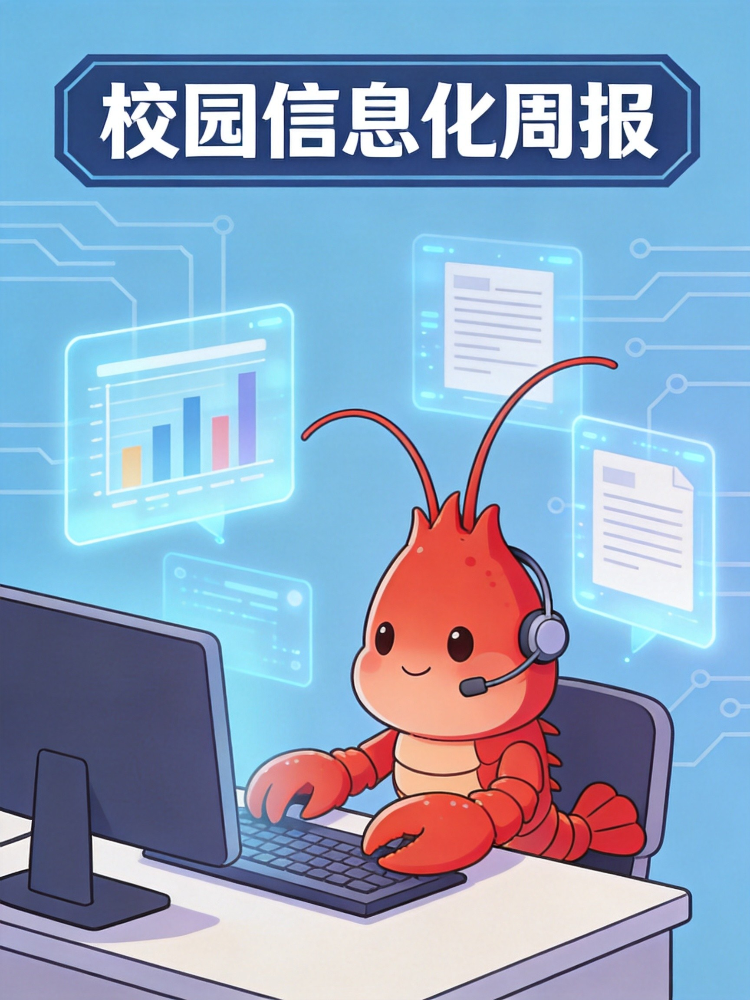
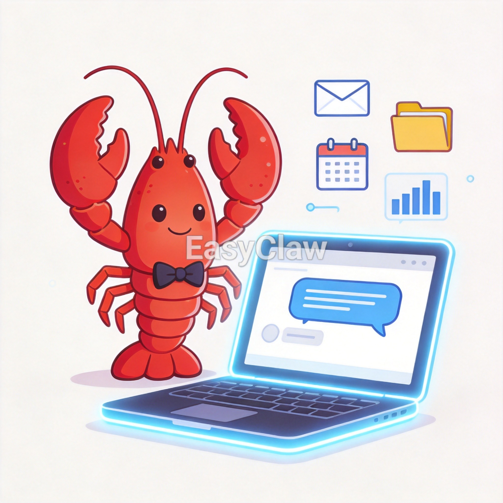
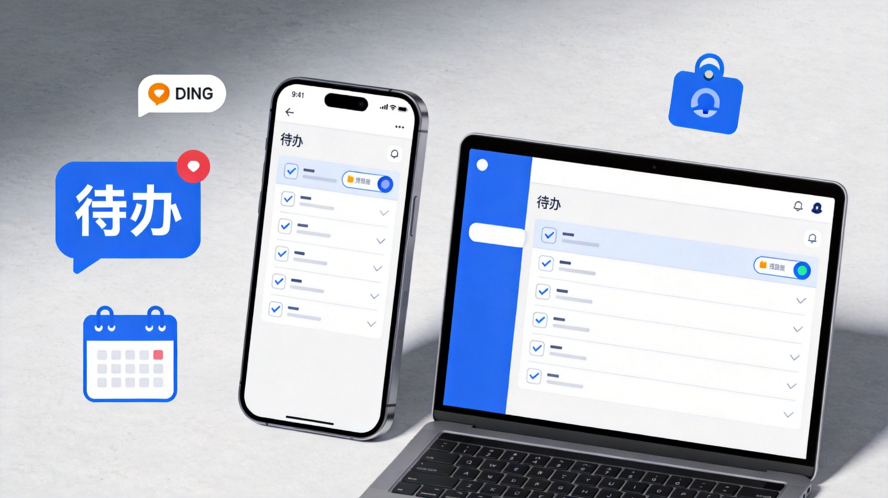
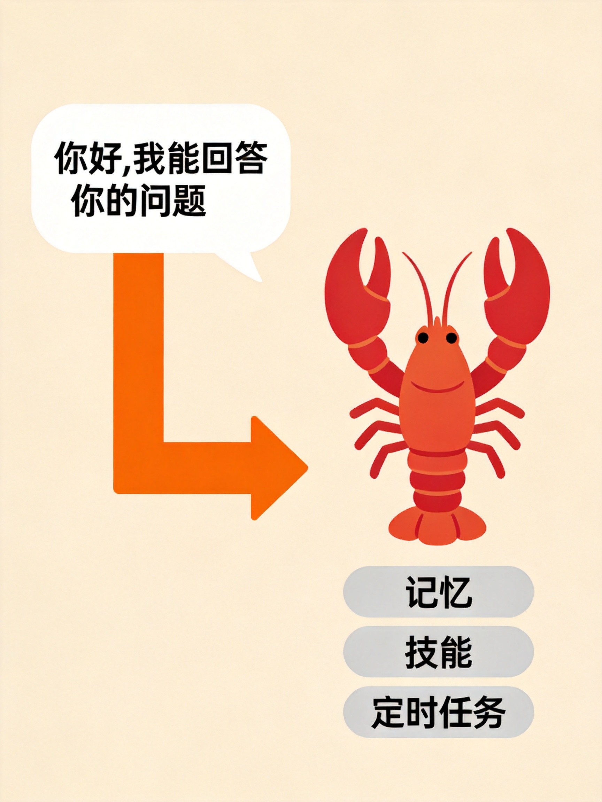

# 校园信息化周报（第 5 期·养只龙虾帮你干活）

> 🏫 宁波诺丁汉大学附属中学 · 智慧办出品
> 📅 2026年5月29日 · 每周五发布

---

各位老师好！

欢迎阅读第5期《校园信息化周报》！

前阵子你一定听到有人在说"养龙虾"——别误会，这不是水产养殖，而是AI圈最火的事。OpenClaw（龙虾）让AI从"动嘴"变成了"动手"，现在热度下来了，但成熟的小龙虾也出现了，这期我们就来聊聊怎么零门槛"领养"一只。

---

## 🔧 本周好物

> 不说废话，只推真正好用的

---

### ✦ EasyClaw——零门槛领养你的AI龙虾

**一句话说清：** 装个软件就有个AI替你操作电脑，写文档、发邮件、整理表格一句话搞定。

**它和普通AI聊天有什么不同？**

| | 普通AI聊天 | 🦞 EasyClaw |
|---|---|---|
| 本质 | 聊天窗口，问一句答一句 | AI数字员工，你说它就干 |
| 记忆 | 关了对话框就忘了 | 记住你的偏好和习惯 |
| 能力 | 只能聊天 | 能操作电脑上的软件和文件 |
| 工作模式 | 你问它答 | 主动执行、定时任务、7×24待命 |
| 数据安全 | 存在云端服务器 | 跑在你自己电脑上，数据不外传 |

**学校怎么用：**

- 📧 **邮件助手**：说一句"把本周教研通知发给全体老师"，它自动打开邮箱、填内容、选联系人、发送
- 📊 **表格处理**：让它"统计本周各班出勤率，生成汇总表"，自动读取数据、计算、出表
- 📋 **文档整理**：把散落的方案文件按类型和日期整理归档
- ⏰ **定时任务**：设置每天早上自动推送当日课表到年级群

**三步上手：**
1. 访问 [cmcm.bot](https://cmcm.bot/) 选择个人版，下载安装包（支持 Windows / macOS）
2. 双击安装，注册账号，自动获得免费积分——零配置，不需要装Python或敲命令
3. 在钉钉/飞书里连接你的龙虾，用聊天就能指挥它干活

💡 **小贴士：** 傅盛（猎豹移动CEO）春节期间亲自调教了14天，养出一只叫"三万"的龙虾——4分钟给611人发了个性化拜年消息，每条都不一样。现在"三万同款"技能包在技能商店一键安装就能用！

🔗 **下载地址：** [cmcm.bot](https://cmcm.bot/) （个人版 + 企业版一站覆盖）｜国内版：[easyclaw.cn](https://easyclaw.cn/)

---

## 🏫 校内攻略

> 你身边的功能，你可能还不知道

---

### 钉钉「待办」——别让事情从聊天记录里溜走

群里说了"周五前交方案"，结果到了周五才发现忘了？聊天记录里埋了无数待办，却从来没有一个地方统一管理？

钉钉自带的「待办」就是干这个的——把散落各处的"要做的事"变成一个清单，到期自动提醒。

**功能亮点：**

- 📌 **聊天里就地创建**：群聊里长按消息 →「转为待办」，自动关联上下文
- 🔔 **智能识别**：聊天中说"明天下午3点提交"这类语句，钉钉能自动识别并建议创建待办
- 🏷️ **分类+标签**：按优先级、截止日期分类，自定义标签（如"已验收""需审核"）
- 📱 **手机电脑同步**：手机创建，电脑查看，跨设备不遗漏

**三步上手：**

1. **创建待办**
   - 方式一：钉钉首页 → 底部「待办」→ 右下角「+」→ 输入内容、截止时间、执行人
   - 方式二：在聊天窗口点击「待办」图标，直接把聊天内容转为待办
   - 方式三：对着聊天说"周五前完成"，开启智能识别后自动建议创建

2. **管理待办**
   - PC端左侧「待办」→ 可按截止时间、优先级、执行人筛选
   - 重要任务右键「置顶」，不被新消息淹没
   - 勾选完成，自动归档并通知相关人

3. **设置提醒**
   - 进入「我的」→「设置与隐私」→「通用」→「消息设置」→「智能待办」
   - 开启「DING强提醒」：高优先级待办弹窗+震动+语音三重提醒
   - 设置免打扰时段：22:00-7:00只推紧急任务

💡 **小贴士：** 开启「自动识别聊天中的待办关键词」后，群聊里说"请今天提交""下周前确认"，钉钉会弹出创建建议，一键就把口语变成结构化待办，再也不会漏事！

---

## 🌏 值得关注

> 教育/政策/AI，只挑和你有关的

---

### 📌 深圳无锡出台"养龙虾"扶持政策

**发生了什么：** 深圳市龙岗区发布《支持OpenClaw&OPC发展若干措施》10条举措；无锡市高新区发布"养龙虾"12条政策，单项支持最高达500万元。

**一句话说明：** 地方政府开始用真金白银鼓励AI Agent发展。

**对我们意味着什么：**
- 🏫 AI Agent不再是极客玩具，地方政府都在推动落地
- 💡 学校可以关注本地是否有类似政策支持AI教育应用

---

### 📌 国家安全部发布"龙虾"安全养殖手册

**发生了什么：** 国家安全部发布OpenClaw安全使用指南，国家互联网应急中心同步发布安全实践指南，提醒用户注意部署安全。

**一句话说明：** AI能干活，但也可能"干坏事"，安全意识不能少。

**对我们意味着什么：**
- ⚠️ 学校部署AI工具时务必注意数据安全，敏感信息不要放在AI工作区
- 🔒 优先选择本地运行、数据不外传的方案（比如EasyClaw的本地模式）

---

### 📌 大厂纷纷推出自己的"龙虾"

**发生了什么：** 阿里推出CoPaw、腾讯推出QClaw和WorkBuddy、钉钉推出Wukong、百度推出移动版OpenClaw、小米内测MiclawAgent、Kimi发布Kimi Claw……各大厂都在入局AI Agent。

**一句话说明：** AI Agent赛道全面爆发，"龙虾"正在变成基础设施。

**对我们意味着什么：**
- 🛒 选择更多了，按需选型——零基础用大厂封装版，有技术能力可以试开源版
- 📊 关注这些产品在教育场景的落地，可能很快就有"教育版龙虾"

---

## 💡 一周一词

**本期词：小龙虾（OpenClaw意义上的）**

> 用大白话解释，看完就能跟人聊

---

### 🦞 "养龙虾"不是搞水产，是养AI

最近朋友圈里有人说"我在养龙虾"，别急着问他卖多少钱一斤——他可能是在说**部署和使用OpenClaw**。

### 为什么叫"龙虾"？

OpenClaw的Logo就是一只红色龙虾，而且这个命名有一段戏剧性的故事：

1. **ClawdBot时代**：最初叫ClawdBot，是"Claude"（大模型）和"Claw"（龙虾螯）的谐音双关——意思是"长了手的AI"
2. **被迫改名**：Anthropic（Claude的开发商）觉得名字太像自家的Claude，要求改名
3. **MoltBot过渡**：开发者改名叫MoltBot——Molt是"蜕壳"的意思，像龙虾成长要脱掉旧壳
4. **最终定名OpenClaw**：Open=开源开放，Claw=保留龙虾基因

### 龙虾的"螯"代表什么？

龙虾的螯（Claw）就是它的"手"。传统AI只有嘴巴（聊天），OpenClaw给AI装上了"手"——能操作电脑、读写文件、执行命令。所以社区有句口号：**"钳即是法"（The claw is the law）**。

### 社区黑话速查

| 黑话 | 意思 |
|---|---|
| 养龙虾 | 部署和使用OpenClaw/EasyClaw |
| 养虾师傅 | 提供付费安装服务的人 |
| 手机龙虾 | 在手机上运行的版本 |
| 蜕壳 | OpenClaw的重大版本更新 |
| 虾塘 | 运行龙虾的电脑/服务器 |

### 知道这个有什么用？

- 🔍 听到同事说"养龙虾"不用一脸懵
- 💡 理解AI从"只会聊天"到"能动手干活"的进化方向
- 🚀 这是2026年AI最火的概念，了解它就了解AI的未来走向

> 📌 央视都专门做了100秒科普视频：*"养龙虾不是搞水产，是让AI从动嘴变成动手"*

---

*📝 投稿·建议·问题 → 智慧办 程凡老师*
